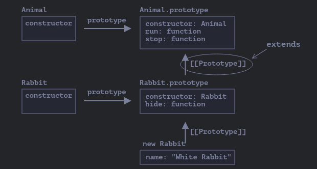
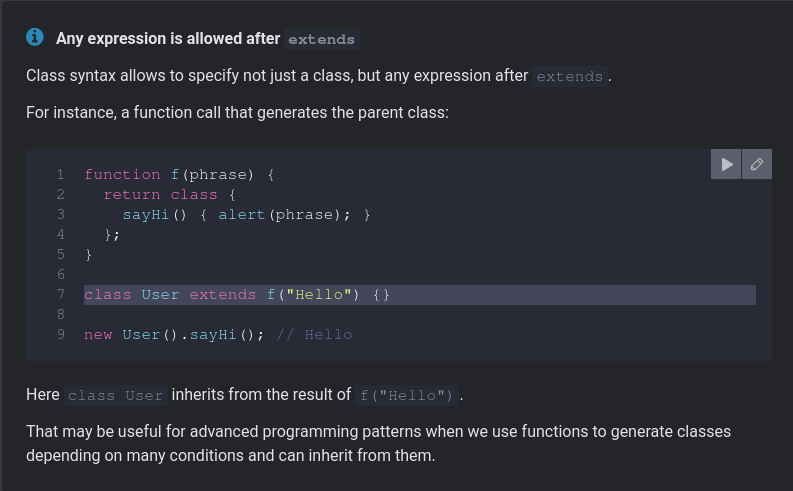

# Inheritance

- The ability to inherit methods and variables from another class is called inheritance.
- The 'extends' keyword is used to inherit from another class. 
- The Child class inherting from the parent class also has access to the parent class's methods and properties.

In this it looks for a method inside the child class, if present it
will call that method else it will look for the method in the parent
class and call that method.

> Extending from a function

> 'Super' keyword is used to inherit from properties from parent class.

> It can be used in the sense that we can tweak the variables as per our wishes without affecting 

> Arrow functions:

-  Do not have 'this'
-  Do not have arguments.
-  Can’t be called with 'new'.
-  They also don’t have 'super'.

> Constructors in inheriting classes must call the 'super' keyword before calling 'this'.

- Reason : In Javascript, there is a distinction between inheriting class and other functions.  The 'derived' class has
		   a special internal property `[[ConstructorKind]]:"derived"`.(Special Internal Label) That label affects its
		   behavior with new.
		   
		   When a new object is created with 'new', it creates a new empty object and assigns it to this.
		   But when a derived constructor runs, it doesn't do this. It relies on the parent constructor to do its job.

> The parent constructor always uses its own field value, not the overridden one. 
> If there is a lack of constructor in the child class the parent constructor class is called.
